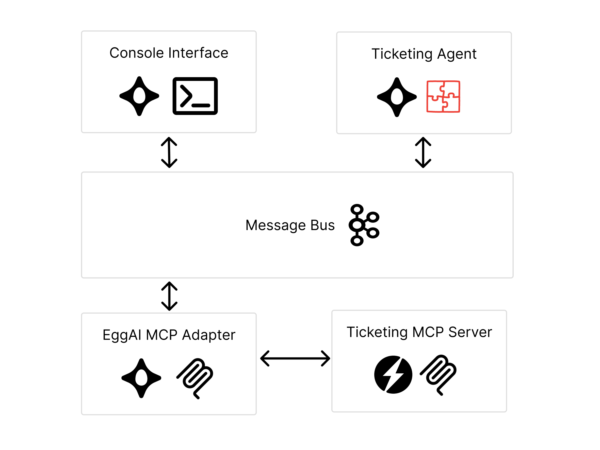

# EggAI MCP-Boosted Agents

This example demonstrates how to integrate Model Context Protocol (MCP) servers with EggAI agents using a custom adapter layer. Through standardized tool calling with message protocol, any MCP server or external service can be easily translated to Kafka messages and seamlessly consumed by EggAI agents, enabling distributed access to external capabilities while maintaining async execution.



## Core Concepts

### Model Context Protocol (MCP)
MCP is a standard protocol for exposing tools and resources to AI systems. In this example:
- **MCP Server** (`start_ticketing_backend.py`): Exposes ticket management functions as tools
- **FastMCP Framework**: Provides the MCP server implementation with HTTP/SSE transport
- **Tool Discovery**: Automatic registration of available functions as callable tools

### EggAI Adapter Pattern
The adapter acts as a bridge between EggAI agents and MCP servers:

**EggAI Adapter Client** (`eggai_adapter/client.py`):
- Connects to MCP servers through EggAI's message transport
- Provides async tool discovery and execution
- Handles request/response correlation with UUIDs

**MCP Adapter Service** (`eggai_adapter/mcp.py`):
- Runs as an EggAI agent subscribing to tool channels
- Translates EggAI messages to MCP protocol calls
- Returns results through the same channel system

## System Components

**Console Interface** (`start_console.py`):
- Simple terminal interface for user interaction
- Publishes user input to EggAI channels
- Displays agent responses

**Agent Implementation** (`start_ticketing_agent.py`):
- DSPy ReAct agent with MCP tool access
- Subscribes to user input channels
- Publishes responses back to console

**Adapter Service** (`start_ticketing_adapter.py`):
- Bridges EggAI messaging to MCP protocol
- Handles tool discovery and execution
- Maintains request correlation

**Backend Service** (`start_ticketing_backend.py`):
- Simple ticket management system
- Exposes CRUD operations as MCP tools
- Runs on HTTP with SSE transport

## Running
**Start docker**:
```bash
make docker-up
```

**Start background server** (runs in parallel):
```bash
make server
```

**Start the console interface** (in a separate terminal):
```bash
make console
```

## Message Flow

1. **User Input**: Console captures user message and publishes to human/agent channels
2. **Agent Processing**: EggAI agent receives message and uses DSPy ReAct for reasoning
3. **Tool Discovery**: Adapter client retrieves available tools from MCP server via tool-dedicated channels
4. **Tool Execution**: ReAct calls tools through adapter, which forwards to MCP server
5. **Response**: Results flow back through the adapter to agent, then to console

## Key Benefits

- **Scalability**: Multiple agents can share the same MCP adapter service
- **Async Execution**: Full async support from console to MCP server
- **Protocol Abstraction**: Agents work with tools without knowing MCP details
- **Distributed Architecture**: Components can run on different machines
- **Tool Reusability**: MCP tools work with any framework through the adapter

## Technical Implementation

### DSPy ReAct Integration
The system integrates with DSPy's ReAct reasoning pattern:

**Tool Conversion** (`eggai_adapter/dspy.py`):
- Wraps MCP tools as DSPy-compatible functions
- Maintains async execution through the adapter layer
- Preserves tool metadata (name, description, parameters)

**Agent Implementation** (`start_ticketing_agent.py`):
- Uses DSPy ReAct for structured reasoning
- Subscribes to EggAI channels for user interaction
- Executes tools through the adapter client

### Async Tool Execution
The adapter ensures async execution throughout the stack:
- DSPy ReAct uses `aforward()` for async reasoning
- Tool functions are wrapped as async callables
- MCP client connections are async-aware

### Request Correlation
Each tool call uses UUID correlation:
- Client generates UUID for each request
- Adapter maintains future objects for response handling
- Responses are matched to original requests

### Error Handling
Comprehensive error handling at each layer:
- MCP server errors are captured and forwarded
- Network failures are handled gracefully
- Agent continues operation despite tool failures